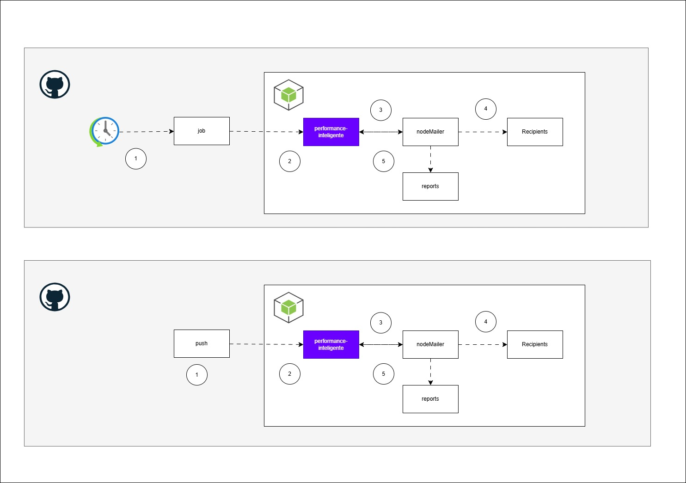

### Performance inteligente
Projeto de Inteligência em performance utilizando k6.io e Node.js.

##
### Overview Solução:

##
### Descricão:
A aplicação consiste em um fluxo de trabalho do GitHub Actions que é acionado diariamente por meio de uma cron job. O fluxo de trabalho executa os seguintes passos:

1. Realiza os testes de carga de performance utilizando o K6.io, com base no script pré-definido.
2. Gera um relatório HTML com as métricas de performance obtidas durante os testes.
3. Faz o upload do relatório HTML como um artefato no GitHub Actions.
4. Copia o artefato para a pasta de envio de e-mail.
5. Envia o relatório por e-mail para um destinatário específico.

##
### Agendamento:
O agendamento da execução do fluxo de trabalho é definido na seção on do arquivo .github/workflows/main.yml. No exemplo abaixo, o fluxo de trabalho é agendado para ser executado todos os dias às 05:00h.

##
### Execução dos Testes de Performance
Os testes de carga de performance são realizados utilizando a ferramenta K6.io. O script de teste é definido no arquivo script.js. O resultado dos testes é gerado em formato de relatório HTML.

##
### Envio do Relatório por E-mail
 
 Após a execução dos testes e a geração do relatório, o fluxo de trabalho copia o relatório para a pasta de envio de e-mail e utiliza a biblioteca Nodemailer para enviar o relatório por e-mail. As credenciais de e-mail e outras informações sensíveis são configuradas como variáveis de ambiente secretas no GitHub para garantir a segurança.

O e-mail é enviado para o destinatário específico definido na variável de ambiente <b>RECIPIENT</b>.

 

 
Exemplo de Relatório de Testes de Performance

  
  <iframe src="performance-inteligente.html" frameborder="0" width="100%" height="300"></iframe>

 
 

 ##
 ### Configuração:
 Para utilizar este fluxo de trabalho em seu próprio repositório, você deve seguir os seguintes passos:

Configure as variáveis de ambiente secretas no GitHub para as credenciais de e-mail, como <b>EMAIL_USER, KEY_GENERATE, e RECIPIENT</b>.

Verifique se o arquivo script.js contém o script de teste de carga desejado.

Certifique-se de que a biblioteca Nodemailer está configurada corretamente e que a função sendMail está enviando o relatório com as métricas corretas.

Ajuste o horário da cron job no arquivo .github/workflows/main.yml para que o fluxo de trabalho seja agendado para o horário desejado em UTC.

Com esses passos, o fluxo de trabalho será agendado para executar os testes de performance, gerar o relatório e enviar as métricas por e-mail diariamente de acordo com o horário configurado.