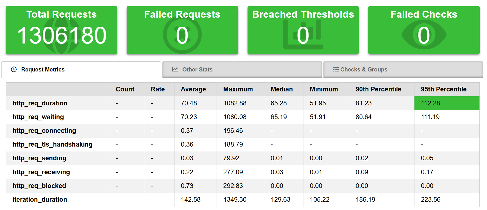
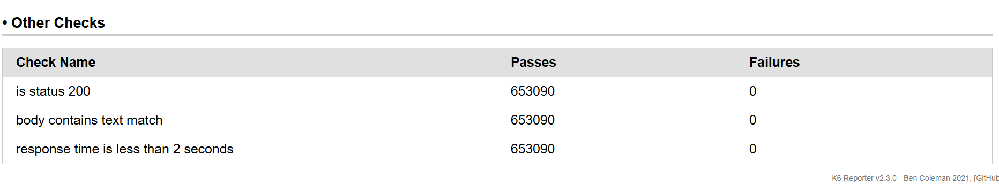

### Performance inteligente
Projeto de Inteligência em performance utilizando k6.io e Node.js.

##
### Overview Solução:

1. Para o primeiro diagrama, segue o fluxo da branch master com job agendado em horário especifico.
2. Para o segundo diagrama, segue o mesmo padrão, com configuração de push na branch de develop para disparar o processo em ambiente de CI.

##
### Descricão:
A aplicação consiste em um fluxo de trabalho do GitHub Actions que é acionado diariamente por meio de uma cron job. O fluxo de trabalho executa os seguintes passos:

1. Realiza os testes de carga de performance utilizando o K6.io, com base no script pré-definido.
2. Gera um relatório HTML com as métricas de performance obtidas durante os testes.
3. Faz o upload do relatório HTML como um artefato no GitHub Actions.
4. Copia o artefato para a pasta de envio de e-mail.
5. Envia o relatório por e-mail para um destinatário específico.

##
### Agendamento:
O agendamento da execução do fluxo de trabalho é definido na seção on do arquivo .github/workflows/main.yml. No exemplo abaixo, o fluxo de trabalho é agendado para ser executado todos os dias às 05:00h.

##
### Execução dos Testes de Performance
Os testes de carga de performance são realizados utilizando a ferramenta K6.io. O script de teste é definido no arquivo script.js. O resultado dos testes é gerado em formato de relatório HTML.

##
### Configuração de Opções (`options`):

### `stages`: Define diferentes fases do teste de carga.
- **`{ target: 500, duration: "3m" }`**: Aumenta o número de usuários virtuais (VUs) para 500 ao longo de 3 minutos.
- **`{ target: 200, duration: "2m" }`**: Diminui o número de VUs para 200 em um período de 2 minutos.
- **`{ target: 0, duration: "1m" }`**: Reduz o número de VUs para 0 ao longo de 1 minuto, simulando o término da carga.

### `thresholds`: Estabelece critérios de sucesso para o teste.

- **`http_req_failed: ['rate<0.01']`**: A taxa de falhas das requisições HTTP deve ser inferior a 1%. Isso significa que, durante o teste, menos de 1% das requisições devem falhar para que o teste seja considerado bem-sucedido.
- **`http_req_duration: ['p(95)<2000']`**: 95% das requisições HTTP devem ter um tempo de resposta inferior a 2000 milissegundos (2 segundos). Isso garante que a maioria das requisições sejam atendidas rapidamente, dentro do limite de 2 segundos.

### Função Principal (`default function`):
- Faz uma requisição HTTP GET para `http://test.k6.io/`.
  
### `check`: Realiza validações na resposta da requisição.
- **`'is status 200'`**: Verifica se o status da resposta é 200 (OK).
- **`'body contains text match'`**: Verifica se o corpo da resposta contém o texto "Collection of simple web-pages suitable for load testing."
- **`'response time is less than 2 seconds'`**: Verifica se o tempo de resposta é menor que 2000 milissegundos (2 segundos), como um double check.

### Função de Resumo (`handleSummary`):
- Gera um resumo dos resultados do teste em um arquivo HTML chamado `summary.html` usando o pacote `k6-reporter`. Isso facilita a visualização dos resultados do teste de carga.

##
### Envio do Relatório por E-mail
 
 Após a execução dos testes e a geração do relatório, o fluxo de trabalho copia o relatório para a pasta de envio de e-mail e utiliza a biblioteca Nodemailer para enviar o relatório por e-mail. As credenciais de e-mail e outras informações sensíveis são configuradas como variáveis de ambiente secretas no GitHub para garantir a segurança.

O e-mail é enviado para o destinatário específico definido na variável de ambiente <b>RECIPIENT</b>.

 

 ##
 ### Configuração:
 Para utilizar este fluxo de trabalho em seu próprio repositório, você deve seguir os seguintes passos:

Configure as variáveis de ambiente secretas no GitHub para as credenciais de e-mail, como <b>EMAIL_USER, KEY_GENERATE, e RECIPIENT</b>.

Verifique se o arquivo script.js contém o script de teste de carga desejado.

Certifique-se de que a biblioteca Nodemailer está configurada corretamente e que a função sendMail está enviando o relatório com as métricas corretas.

Ajuste o horário da cron job no arquivo .github/workflows/main.yml para que o fluxo de trabalho seja agendado para o horário desejado em UTC.

Com esses passos, o fluxo de trabalho será agendado para executar os testes de performance, gerar o relatório e enviar as métricas por e-mail diariamente de acordo com o horário configurado.
